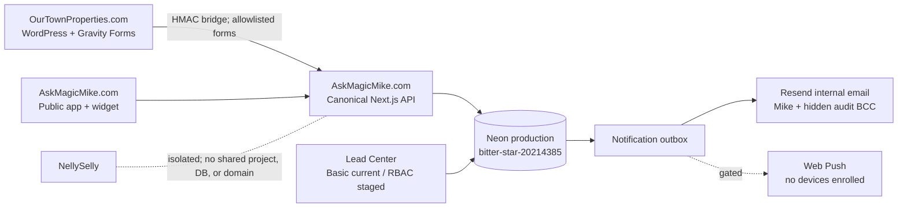

# Ask Magic Mike Phase 2 Architecture

WordPress preserves SEO and local entries. It is not a competing canonical CRM. Form 3 is the only allowlisted production bridge form. The RBAC tables use `lead_center_*` names so they cannot collide with lead-attribution sessions.
